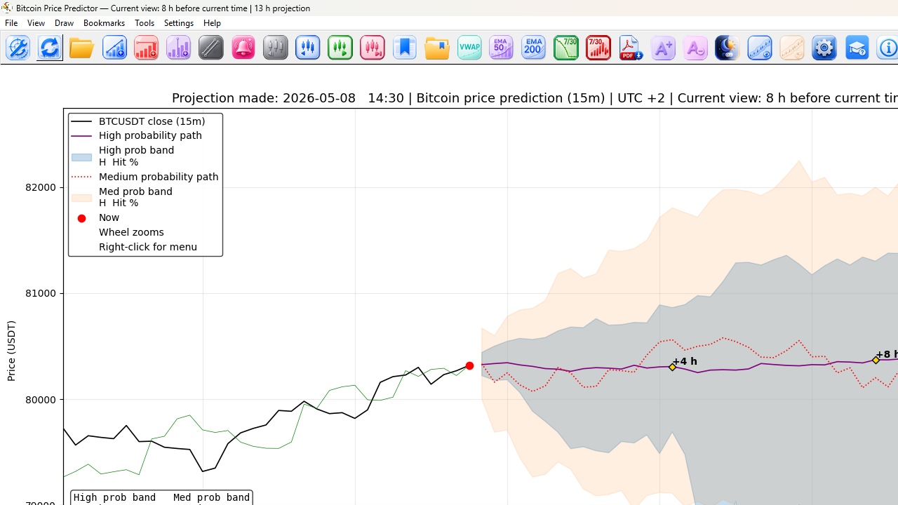

# Bitcoin Price Predictor




Bitcoin Price Predictor is an informational, educational, and research tool for analyzing Bitcoin price data, probability paths, projection bands, calibration results, alerts, and chart-based market structure.

The software is designed to help users visually explore Bitcoin price movement, compare projected probability paths, review historical calibration behavior, and monitor possible future price zones using data-driven calculations.

Bitcoin Price Predictor is not a trading bot and does not place trades. It does not manage accounts, funds, orders, exchanges, brokers, wallets, margin, leverage, or positions.

---

## Important Disclaimer

Bitcoin Price Predictor is provided for informational, educational, and research purposes only.

This software does **not** provide financial advice, investment advice, trading advice, tax advice, legal advice, or recommendations to buy, sell, short, hold, trade, or invest in any asset.

Cryptocurrency trading involves risk. Projections, probability paths, alerts, indicators, calibration results, chart overlays, and exported summaries are estimates only. They may be inaccurate, delayed, incomplete, outdated, or affected by market volatility, data errors, API issues, exchange issues, software bugs, connectivity problems, missing files, or incorrect configuration.

Use Bitcoin Price Predictor entirely at your own risk.

---

## Features

Bitcoin Price Predictor helps users review and visualize:

- BTCUSDT 15-minute price movement
- Projected probability paths
- Projection bands and possible future price zones
- Historical calibration behavior
- Chart-based market structure
- Alerts and visual reference levels
- Calibration rebuild results
- Exported research and analysis data

The software is intended as a research and visualization tool only.

---

## Download

The latest release can be downloaded from the **Releases** section of this repository.

Go to:

```text
Releases → Latest release → Download the installer/executable
